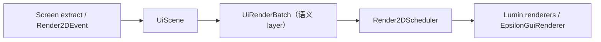

# Epsilon GUI 架构

> `gui/lib` 的 API、边界和使用示例见 [GUI Library 文档](gui-library.md)。

## 业务宿主

Epsilon 的 GUI 由以下 Screen 宿主组成，业务状态和输入交互都在宿主内，渲染统一提交到 `UiScene`：

- `PanelScreen`：模块浏览、Setting 编辑和客户端数据页。
- `DropdownScreen`：可拖动分类面板、搜索和 Setting 控件。
- `MainMenuScreen`：主菜单背景（视频或 `GlslSandBox` 着色器）与操作入口。
- `HudEditorScreen`：HUD 布局、锚点、选择框和预览。
- `WelcomeScreen` / `AccountsScreen`：欢迎页和账号管理。

每个 Screen 各持有一个 `UiScene`，在 `extractRenderState(GuiGraphicsExtractor, int, int, float)` 中
`beginFrame()` → 构建 `UiTree` → 提交 → `endFrame()`/`flush()` + `clear()`。

## 渲染链



`MixinGuiRenderer` 在 `GuiRenderer.render` 头部依次发布 `Render2DEvent.Level` 与 `Render2DEvent.HUD`，
`HudElementManager` 与各模块在这些事件中提交命令；原版提取结果随后由 `EpsilonGuiRenderer` 统一输出。

## Panel 与 Dropdown

Panel 业务组件位于 `gui/panel`（`adapter/` 承载 `SettingListController`、`SettingViewFactory`、
`ModuleViewModel`，`view/` 承载各面板），Dropdown 业务组件位于 `gui/dropdown`。Setting 的可见性、分组和
布局仍由 SettingHost、`SettingLayoutPlanner` 与相邻 adapter/view 决定；`gui/lib` 不读取 Module 或
Setting。

PanelScreen 的语义 layer 使用：

- `CHROME -20`：主面板、rail、modules/detail 背景。
- `CONTENT -20`：Category rail；`CONTENT 0`：模块列表；`CONTENT 10`：客户端设置页；
  `CONTENT 20`：模块详情。
- `POPUP`：弹窗外壳和弹窗普通图元。

DropdownScreen 用 `scene.batch(UiLayer.CONTENT)` 提交所有面板，弹窗单独提交到 `UiLayer.POPUP`，
最后 `scene.flush()`。存在 painter order 的 background、content、floating 和 popup pass 必须使用
显式 layer 或相对 layer。

## Setting 分组渲染

`SettingLayoutPlanner` 把显式 SettingGroup 规划成 section 树：`Section.elements()` 按声明顺序保留
「直接 Setting」与「子分组」的交错关系，`Section.children()` 只是过滤后的子分组视图。GUI 只消费
section 树，不推断分组结构。

- Dropdown 的 `SettingSectionRenderer` 统一服务 `SettingsContent` 与 `ModuleButton`：绘制坐标使用调用
  方 scope 的局部坐标，命中测试使用 `局部坐标 + hitOffset` 的绝对坐标，控件的绝对位置缓存因此可直接
  参与命中。
- 展开的分组绘制整块卡片背景，覆盖组头与子内容（`DropdownTheme.groupCardBackground`），组头悬浮层叠
  在卡片之上；嵌套层级通过 `DropdownTheme.groupNestInset` 递增缩进，表面色随层级变浅，达到
  `GROUP_DEPTH_LIMIT` 后不再增加缩进与色差，并在宽度不足时自动收敛。
- Panel 的 `SettingListController` 递归绘制同样的卡片：`GROUP_NEST_INSET` 控制每层缩进，`groupSurface`
  与 `groupOutline` 控制嵌套配色，顶部卡片保持原有外观。
- 组头的数量徽标使用 `Section.totalSettingCount()`，即自身与所有子孙分组的 Setting 总数。
- 父分组折叠时子孙不绘制、不参与命中与按键分发；折叠任意层级的分组会递归 blur 该子树内的文本、滑条与
  颜色输入。

## Popup

Popup 由 `PanelPopupHost` 统一管理，使用 `UiLayer.POPUP`；可滚动内容进入 `UiContentBuffer`，
普通图元仍由主 scene 输出。Popup 的私有缓冲通过 `popupHost.flush()` 在 scene flush 之后释放。

## HUD

`HudElementManager` 在 `Render2DEvent.HUD` 中构建整帧 HUD：

- 每个启用的 `HudModule` 调用 `updateLayout()` 后通过 `renderWithBatch(deltaTracker, batch)` 把节点
  追加到共享 `UiScene`，整帧只 flush 一次。
- 原版物品等 `GuiGraphicsExtractor` overlay 走 `renderOverlay(graphics, deltaTracker)`，不进入 GUI 树。
- `HudEditorScreen.renderPendingHudElements()` 在独立的 HUD Editor render target 上以
  `CONTENT -40` 提交 HUD 预览，编辑器 chrome 与预览保持分离。
- HUD 尺寸通过 `setBounds()` 更新，位置通过 `moveTo`/`moveBy` 和 anchor API 修改；锚点数学由
  `HudLayoutHelper` 提供，不得绕过 anchor 状态直接写持久化坐标。

## 坐标和命中

GUI 使用 Lumin 逻辑坐标。鼠标位置通过 `LuminRenderSystem.toEpsilonMouseX/Y(...)` 转换，
scissor 通过 `LuminRenderSystem.toFramebufferScissor(...)` 转换；布局、文本测量、scissor 和命中测试
共享同一逻辑尺寸，不得额外除以 GUI scale。世界坐标到屏幕坐标使用 `WorldToScreen`。

## 字体和主题

`StaticFontLoader.defaultFont()` 解析默认/自定义字体，`TtfFontLoader` 负责 glyph atlas 与每帧上传预算。
缺字由 `TtfFontLoader.getFallbackGlyph(int)` 的“口”字形占位框顶上（占位字形同样写入 atlas），
真实字形上传后自动换回；空白与控制字符不画占位框。
绘制与测量必须使用相同 font loader 和 scale。主题由 `MD3Theme` 生成调色板，业务代码通过
`EpsilonUiTheme.INSTANCE` 以 `UiTheme` 接口访问，不得在控件中维护独立颜色表或 renderer。

## 验证

仓库当前不维护 GUI 测试源码。修改 Screen、HUD 或 layer 顺序后至少运行双平台编译，并启动受影响的
客户端路径检查坐标、字体、scissor 和 painter order：

```shell
./gradlew :common:compileJava
./gradlew :fabric:compileJava :neoforge:compileJava
```
